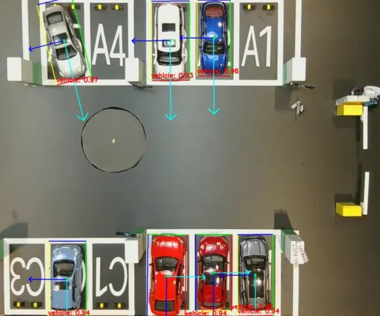
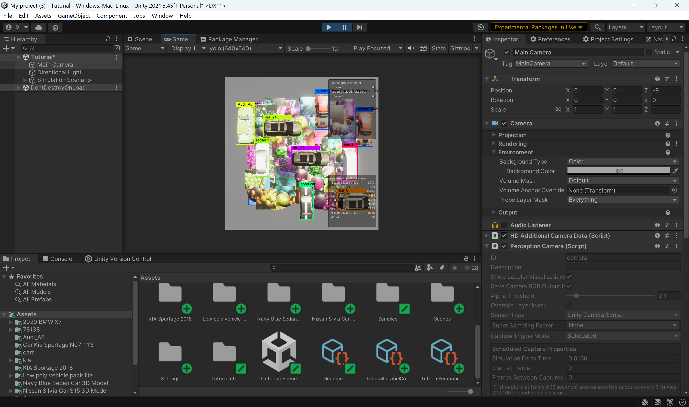
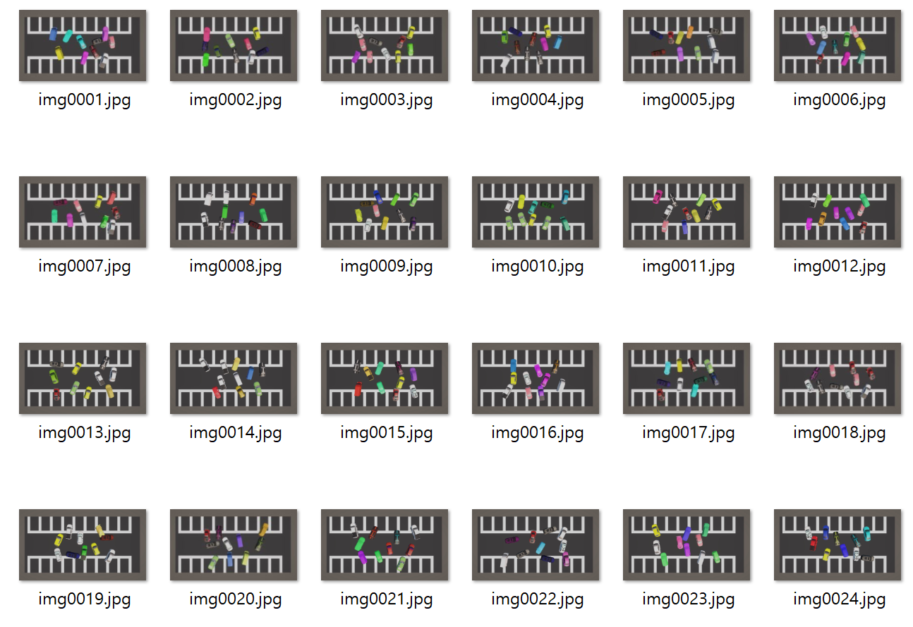
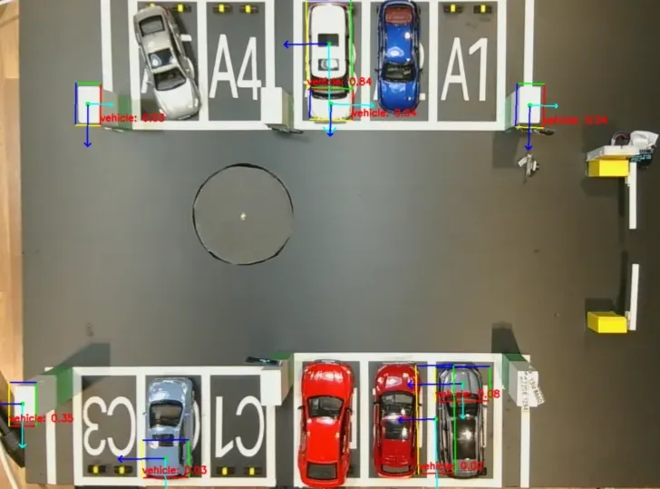
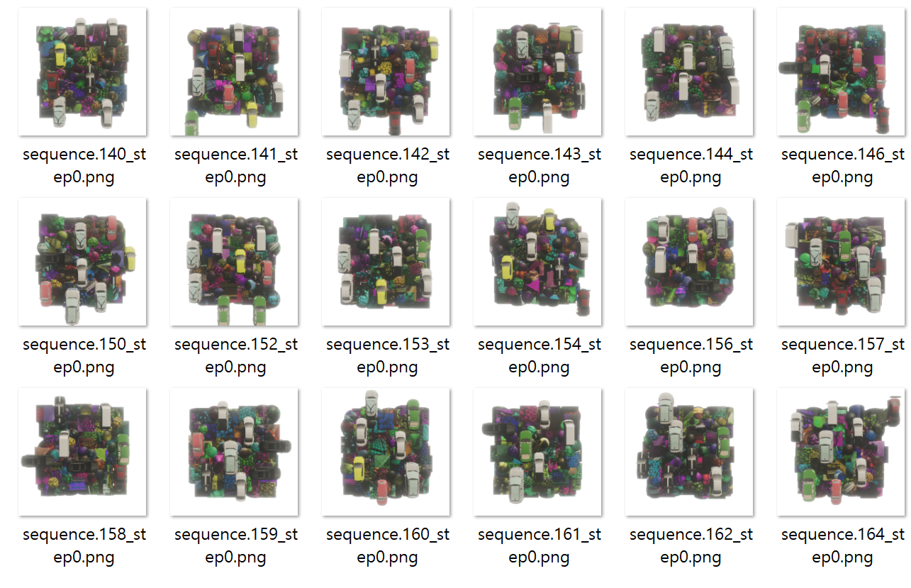
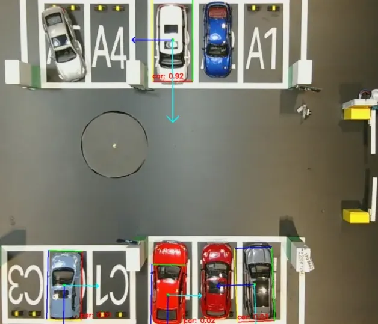
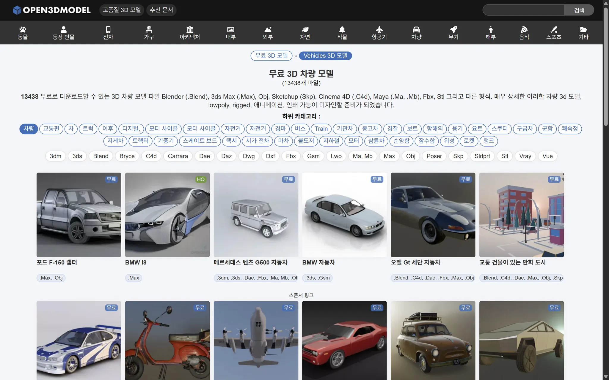
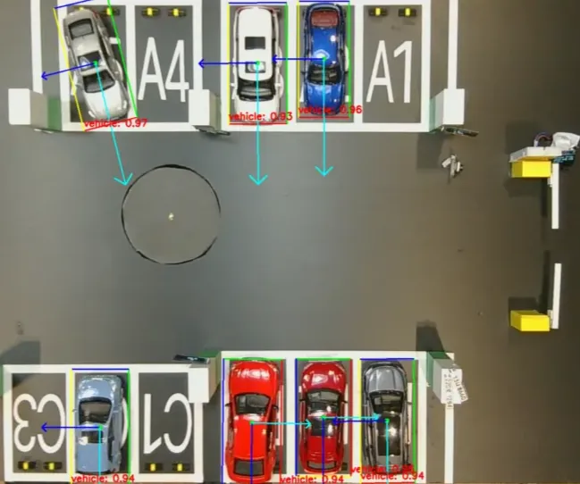
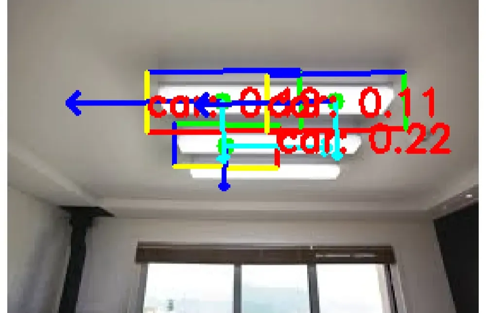
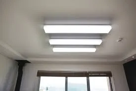

# Unity 활용 합성 데이터 기반 차량 OBB 모델 개발

### 프로젝트 개요
 본 프로젝트를 통해 탑뷰 환경에서 차량을 안정적으로 탐지하고 방향까지 인식할 수 있는 모델을 구현하였다. 가상환경에서 생성한 데이터셋으로 학습한 YOLO11s-OBB 모델은 다양한 조명, 배경, 차량 등의 조건에서도 강건성을 확보했으며, Jetson 환경에서도 자연환경에 대응 가능함을 확인하였다.
 - <b>주제</b>: 스마트 주차장 차량 탐지 및 방향 인식
 - <b>성과</b>: 가상환경 기반 데이터셋을 학습하여, 자연환경에서도 차량 방향 인식 가능성 확인
 - <b>도전과제</b>: 데이터셋 부족, 자연환경에서의 일반화 문제
 - <b>기간</b>: 2025.07.14 ~ 2025.08.18
 - <b>최종 모델</b>: YOLO11s-OBB

### 개발환경

| 전체 개발 흐름 |
|----------------|
|   |

| 주차장 모방 가상환경 | Perception 패키지 기반환경 |
|----------------------|---------------------------|
|  |  |

### 문제 정의

### 해결 과정

#### 1. 데이터셋 구축

&nbsp;유니티에서 타일맵으로 주차장을 모방한 환경을 조성했다. 이후 LowPoly 차량 에셋을 무작위로 배치하는 스크립트를 통해 학습데이터를 구축했다. 학습결과 차량 인식 경향성은 확보했지만 노이즈가 존재했다.

| 주차장 가상환경 | 생성된 데이터셋 | 학습 결과 |
|----------------------|---------------------------|---------------------------|
|  |  |  |

#### 2. 메모리 관리 최적화

&nbsp; 객체를 빠르게 생성하고 삭제하는 과정에서 메모리 오버헤드가 발생했다. 8천 건을 생성하는 과정에서 프로그램이 강제종료 되었다. 이를 해결하기 위해서 사전 렌더링을 활용한 메모리 풀 방식으로 10GB 이상의 데이터셋을 안전하게 생성할 수 있게 되었다.

#### 3. 노이즈 강건성 확보

&nbsp; 1 의 과정에서 차량이 아닌 객체를 오인식하는 문제가 발생했다. 이를 Perception 패키지로 합성 데이터셋을 추가로 생성했다. 이 데이터를 추가해서 노이즈 강건성을 확보했다.

> **Perception 패키지**  
> Perception 패키지는 대규모 합성 데이터셋을 생성하는 툴킷을 제공한다. 

| 주차장 가상환경 | 생성된 데이터셋 | 학습 결과 |
|----------------------|---------------------------|---------------------------|
|  |  |  |

#### 4. 일반화 문제 해결

&nbsp; 일부 차량이 인식되지 않는 문제가 있었다. 도색이 다르거나 썬루프가 있는 경우 등의 변수에 대응하기 어려워했다. 이는 차량의 일반성을 구분하지 못했기 때문이라고 생각했고, 공개 에셋에서 차량들을 추가해서 일반화 성능을 강화했다.

| 공개 에셋 페이지 | 개선 후 사진 |
|----------------------|---------------------------|
|  |  |

&nbsp; 또한, 밝은 조명을 차량으로 인식하는 문제가 있었는데, Perception 환경에서 밝기를 조정해서 경계인식을 강화했다.

| 조명을 인식하는 사진 | 개선 후 사진 |
|----------------------|---------------------------|
|  |  |

#### 5. 실제 적용 단계 문제 및 해결

| 문제 항목        | 원인/상황                            | 해결/결과           |
| ------------ | -------------------------------- | --------------- |
| 인식률 저하       | 입력 이미지 리사이즈 비율 조정 필요             | 최적 크기 탐색을 통해 개선 |
| 해상도 변경 시 딜레이 | OpenCV 해상도 변경 과정에서 윈도우 백엔드 문제 발견 | 환경 변수 수정으로 해결   |
| 탐지 박스 퍼짐 현상  | Jetson 환경 적용 이후 발생               | 적용 후 자연스럽게 개선됨  |

#### 6. 결과 및 회고

&nbsp; 탑뷰에서 차량과 방향을 안정적으로 탐지 가능해졌으며, 노이즈 강건성을 확보해 자연환경에서도 대응 가능함을 확인했다. 이번 프로젝트는 데이터셋 부족 -> 가상환경 구축 -> 데이터셋 개선 -> 모델 학습 개선 -> 실제 적용까지의 전 과정을 직접 설계하고 수행하는 경험이었다.
