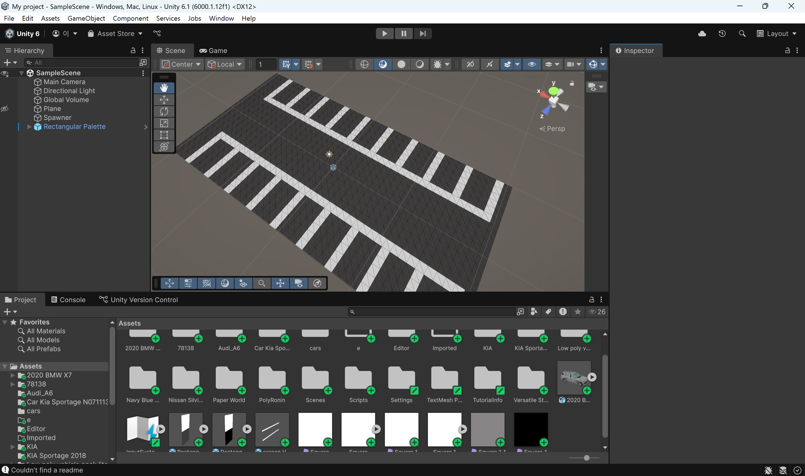
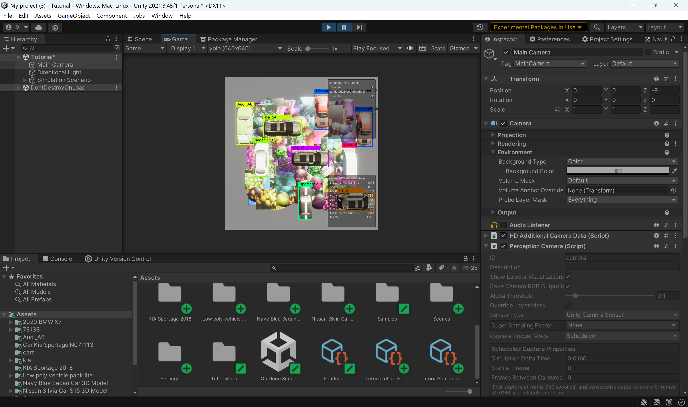
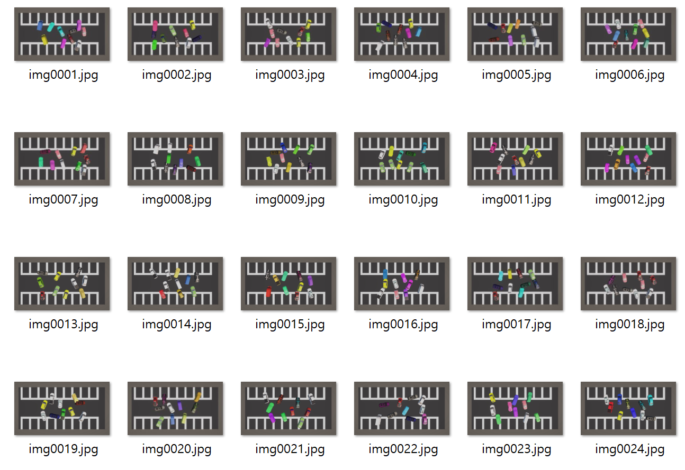
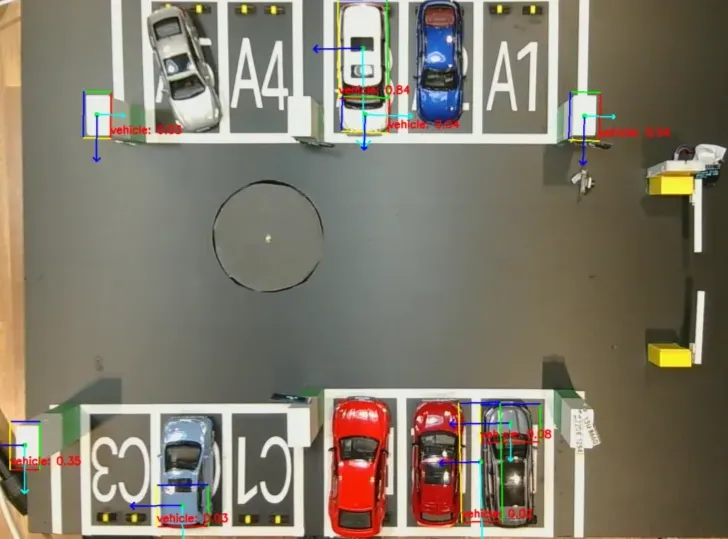
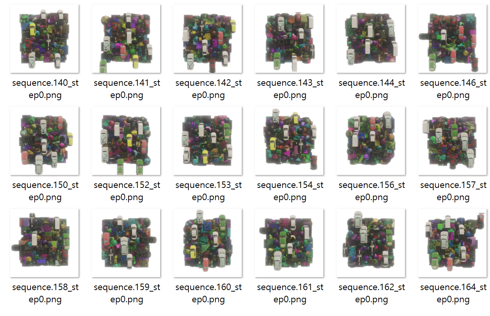
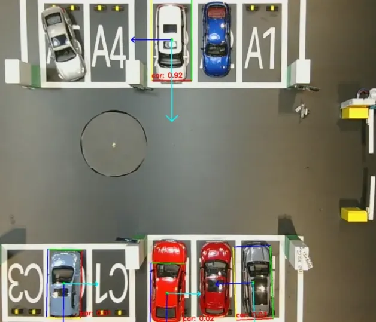

# Unity 활용 합성 데이터 기반 차량 OBB 모델 개발

### 프로젝트 개요
 본 프로젝트를 통해 탑뷰 환경에서 차량을 안정적으로 탐지하고 방향까지 인식할 수 있는 모델을 구현하였다. 가상환경에서 생성한 데이터셋으로 학습한 YOLO11s-OBB 모델은 다양한 조명, 배경, 차량 등의 조건에서도 강건성을 확보했으며, Jetson 환경에서도 자연환경에 대응 가능함을 확인하였다.
 - <b>주제</b>: 스마트 주차장 차량 탐지 및 방향 인식
 - <b>성과</b>: 가상환경 기반 데이터셋을 학습하여, 자연환경에서도 차량 방향 인식 가능성 확인
 - <b>도전과제</b>: 데이터셋 부족, 자연환경에서의 일반화 문제
 - <b>기간</b>: 
 - <b>최종 모델</b>: YOLO11s-OBB

### 개발환경

| 전체 개발 흐름 |
|----------------|
| .png>)  |

| 주차장 모방 가상환경 | Perception 패키지 기반환경 |
|----------------------|---------------------------|
|  |  |

### 문제 정의
- 탑뷰 관점에서 차량을 인식하고 방향까지 추적해야 했지만 적절한 학습 데이터셋이 희소함
- 직접 라벨링은 생산성이 낮아 현실적이지 않음
- 가상 데이터셋 생성 및 다양한 노이즈 반영이 필요했음

### 해결 과정

#### 1. 데이터셋 구축

&nbsp;유니티에서 타일맵으로 주차장을 모방한 환경을 조성했다. 이후 LowPoly 차량 에셋을 무작위로 배치하는 스크립트를 통해 학습데이터를 구축했다. 학습결과 차량 인식 경향성은 확보했지만 노이즈가 존재했다.

| 주차장 가상환경 | 생성된 데이터셋 | 학습 결과 |
|----------------------|---------------------------|---------------------------|
|  |  |  |

#### 2. 메모리 관리 최적화

&nbsp; 객체를 빠르게 생성하고 삭제하는 과정에서 메모리 오버헤드가 발생했다. 8천 건을 생성하는 과정에서 프로그램이 강제종료 되었다. 이를 해결하기 위해서 사전 렌더링을 활용한 메모리 풀 방식으로 10GB 이상의 데이터셋을 안전하게 생성할 수 있게 되었다.

#### 3. 노이즈 강건성 확보

&nbsp; 1 의 과정에서 차량이 아닌 객체를 오인식하는 문제가 발생했다. 이를 Perception 패키지로 합성 데이터셋을 추가로 생성했다. Perception 패키지는 대규모 합성 데이터셋을 생성하는 툴킷을 제공한다. 이 데이터를 추가해서 노이즈 강건성을 개선했다.

| 주차장 가상환경 | 생성된 데이터셋 | 학습 결과 |
|----------------------|---------------------------|---------------------------|
|  |  |  |

#### 4. 